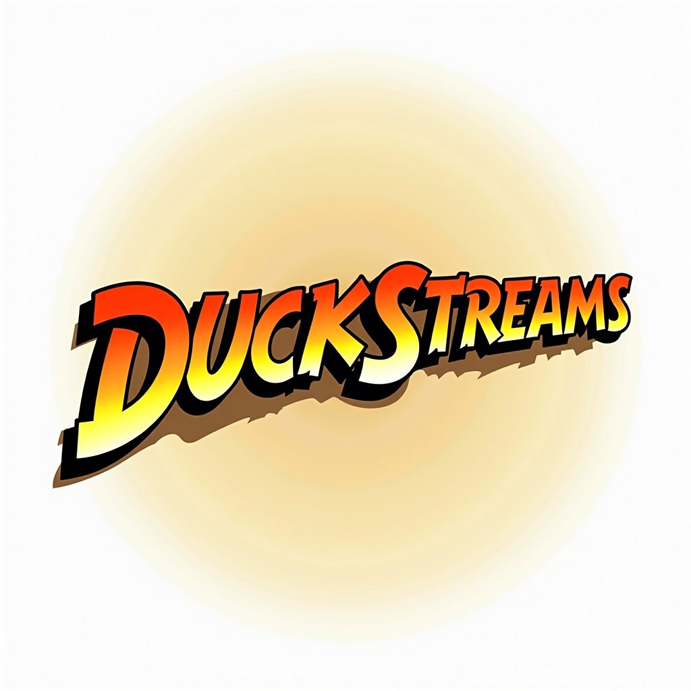

# DuckStreams

**Description:**  
DuckStreams acts as a virtual database on top of your Kafka and Redpanda
clusters, effectively providing an ephemeral SQL interface for querying
streaming data.

**Scope:**  
DuckStreams turns Kafka and Redpanda topics into SQL-accessible virtual tables,
allowing users to query streaming data in real-time. The project interfaces with
the schema registry to map topics to tables and supports deserializing data in
formats like JSON, Protobuf, and Thrift. Using DuckDB, DuckStreams creates
ephemeral tables, runs queries on them, and returns results without persisting
any data. It’s designed to be lightweight, fully in-memory, and ideal for
querying dynamic stream data without caching or long-term storage.

